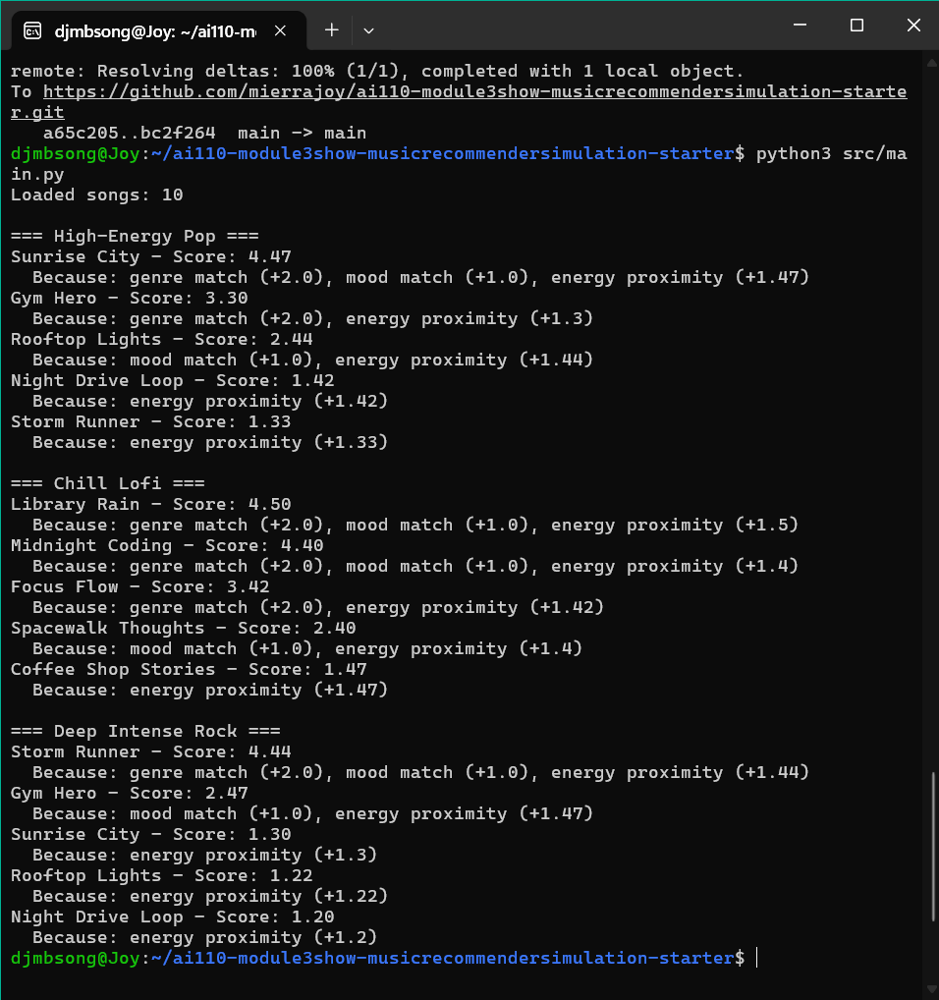

# 🎵 Music Recommender Simulation

## Project Summary
This project basicaly simulates a content-based music recommendation system. It loads a catalog of songs from a CSV file, scores each song against a user's taste profile, and returns the top ranked suggestions with explanations.

## How The System Works

Real-world platforms like Spotify do actually use a mix of collaborative filtering (what similar users liked) and content-based filtering (matching song attributes to your taste). This simulation focuses on content-based filtering, it compares each song's genre, mood, and also energy level directly to the user's preferences.

**Algorithm Recipe:**
 +2.0 points for a genre match
 +1.0 point for a mood match
 Up to +1.5 points based on how close the song's energy is to the user's target energy

**Features used:** genre, mood, energy

## Terminal Output Screenshots

## Potential Biases
Honestly, this system may over-prioritize genre since it carries the highest point weight (+2.0). A song that perfectly matches mood and energy but has a different genre will almost always rank lower than a genre-matching song with poor mood and energy alignment.